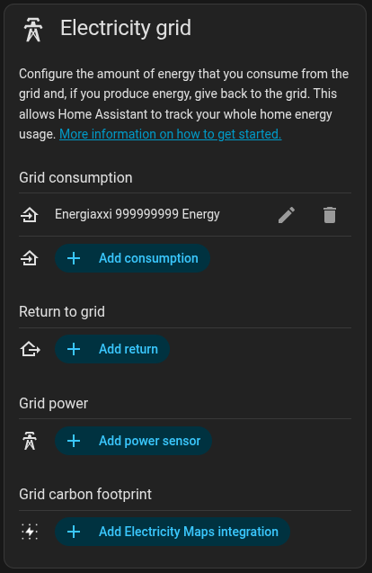

  

# EnergiaXXI — Custom integration for Home Assistant

This repository contains a simple custom integration for Home Assistant that retrieves energy consumption information from the
[EnergiaXXI](https://www.energiaxxi.com/) electricity supplier.

### Installation via HACS

1. In HACS, open the three-dot menu → **Custom repositories**.
2. Add `https://github.com/ToniCifre/energiaxxi` with category **Integration**.
3. Search for **Energiaxxi**, install it, and restart Home Assistant.
4. Go to **Settings → Devices & Services → Add Integration → Energiaxxi** and enter your credentials.

> The integration logo shown in the Home Assistant UI comes from the
> [home-assistant/brands](https://github.com/home-assistant/brands) repository. The ready-to-submit
> assets live in [`brands/energiaxxi/`](brands/energiaxxi) — copy them to
> `custom_integrations/energiaxxi/` in a brands PR so the icon/logo appear in HA and HACS.

### Quick summary

- Domain: `energiaxxi`
- Purpose: query hourly consumption and contract-related data linked to an EnergiaXXI account and expose them as sensors
  in Home Assistant.
- Integration: uses a `config_flow` (integration configuration UI) and the `curl-cffi` library to communicate with the
  web API.

### Manual installation

1. Copy the `custom_components/energiaxxi` folder into your Home Assistant `custom_components` directory (usually
   `/config/custom_components/energiaxxi`).
2. Restart Home Assistant.
3. Go to Settings -> Devices & Services -> Add Integration -> Search for "Energiaxxi" and complete the configuration
   flow (username/password).

### What it exposes

Hourly consumption statistics for each contract detected in the account (identified by `contractNumber`). It cannot be created as a sensor because the data reported by EnergiaXXI is a week behind.

You can import the statistics created as a grid consumption in electricity grid.

### Main component files

- `custom_components/energiaxxi/api.py` — HTTP client that authenticates and fetches detailed consumption data.
- `custom_components/energiaxxi/sensor.py` — Entity (sensor) definitions to expose consumption values.
- `custom_components/energiaxxi/config_flow.py` — Configuration flow for the Home Assistant UI.
- `custom_components/energiaxxi/common.py`, `const.py` — Shared utilities and constants.
- `custom_components/energiaxxi/manifest.json` — Integration metadata and dependencies.

### Important behavior

- The client uses basic authentication built from the user ID and a token (`tgt`) returned by the API.
- If the API returns a response containing the word "incapsula" in an error body, the component raises `IncapsulaDetectedError` (web protection detected).
- If credentials are invalid, the component raises `InvalidCredentialsError`.
