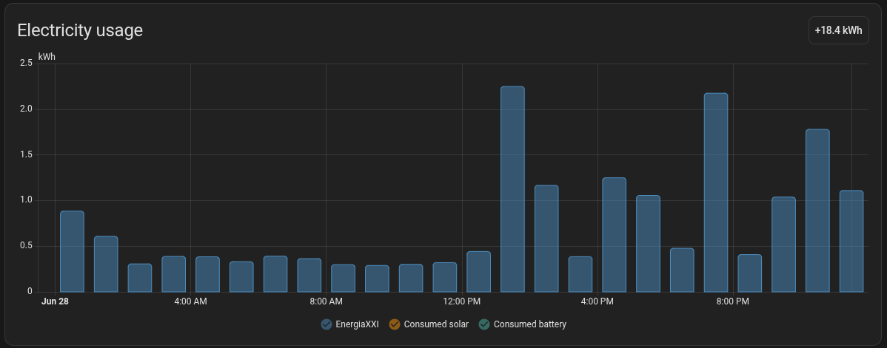

  

# EnergiaXXI — Custom integration for Home Assistant

This repository contains a simple custom integration for Home Assistant that retrieves energy consumption information from the
[EnergiaXXI](https://www.energiaxxi.com/) electricity supplier.

### Installation via HACS

1. In HACS, open the three-dot menu → **Custom repositories**.
2. Add `https://github.com/ToniCifre/energiaxxi` with category **Integration**.
3. Search for **Energiaxxi**, install it, and restart Home Assistant.
4. Go to **Settings → Devices & Services → Add Integration → Energiaxxi** and enter your credentials.

> The integration logo shown in the Home Assistant UI comes from the
> [home-assistant/brands](https://github.com/home-assistant/brands) repository. The ready-to-submit
> assets live in [`brands/energiaxxi/`](brands/energiaxxi) — copy them to
> `custom_integrations/energiaxxi/` in a brands PR so the icon/logo appear in HA and HACS.

### Quick summary

- Domain: `energiaxxi`
- Purpose: query hourly consumption and contract-related data linked to an EnergiaXXI account and expose them as
  long-term statistics (energy, PVPC cost and PVPC price) in Home Assistant.
- Integration: uses a `config_flow` (integration configuration UI) and the `curl-cffi` library to communicate with the
  web API.

### Manual installation

1. Copy the `custom_components/energiaxxi` folder into your Home Assistant `custom_components` directory (usually
   `/config/custom_components/energiaxxi`).
2. Restart Home Assistant.
3. Go to Settings -> Devices & Services -> Add Integration -> Search for "Energiaxxi" and complete the configuration
   flow (username/password).

### What it exposes

- **Hourly energy statistics** per contract (`energiaxxi:energiaxxi_<contract>_energy`, kWh). These are
  external statistics rather than live sensors, because EnergiaXXI reports the data about a week behind.
- **Hourly cost statistics** for **PVPC** contracts (`energiaxxi:energiaxxi_<contract>_cost`), computed from
  the official CNMC PVPC hourly prices. This is an approximation of the PVPC energy term — it does not
  include the fixed power term or taxes.
- A **PVPC price statistic** (`energiaxxi:pvpc_price`, `<currency>/kWh`), a national hourly-mean statistic
  imported independently of the account — it is updated whether or not consumption data is available.
- A **device** per contract (identified by its CUPS) with a diagnostic *Last reading* sensor that exposes
  the contract metadata (CUPS, tariff, contracted power).

### Adding it to the Energy dashboard

Go to **Settings → Dashboards → Energy → Electricity grid → Add consumption** and pick the
*Energiaxxi … Energy* statistic. For PVPC contracts, set **Cost tracking → Use a statistic that tracks total
costs** and choose the matching *Energiaxxi … Cost* statistic.

  

Once configured, the hourly consumption shows up in the Energy dashboard:

  

### Options

After adding the integration, open its **Configure** dialog (Settings → Devices & Services → Energiaxxi →
Configure) to tune:

| Option | Default | Description |
|--------|---------|-------------|
| Consumption history window (days) | 25 | Days of consumption requested each update. Endesa only serves the current billing period, so large values may not return older data. |
| Price history window (days) | 7 | Days of PVPC prices imported each update. |
| Consumption update interval (hours) | 12 | How often to poll Endesa (max 48). |
| Price update interval (hours) | 12 | How often to poll the CNMC for prices (max 48). |

Consumption and prices are fetched by two independent coordinators, so they poll on their own schedules —
prices keep updating even if the Endesa fetch fails.

### Main component files

- `custom_components/energiaxxi/api.py` — HTTP client that authenticates and fetches detailed consumption data.
- `custom_components/energiaxxi/prices.py` — client for the CNMC public PVPC hourly price API.
- `custom_components/energiaxxi/coordinator.py` — separate price and consumption `DataUpdateCoordinator`s that fetch data and import statistics.
- `custom_components/energiaxxi/statistics.py` — imports the energy, cost and price external statistics.
- `custom_components/energiaxxi/sensor.py` — diagnostic *Last reading* sensor and per-contract device.
- `custom_components/energiaxxi/config_flow.py` — configuration and options flow for the Home Assistant UI.
- `custom_components/energiaxxi/common.py`, `const.py` — shared utilities and constants.
- `custom_components/energiaxxi/manifest.json` — integration metadata and dependencies.

### Services

- **`energiaxxi.clear_statistics`** — deletes all imported statistics (per-contract energy and cost, plus the
  national PVPC price) so they can be rebuilt from scratch. Run it from *Developer Tools → Actions* (search
  for "Energiaxxi: Clear statistics"); the next update repopulates the statistics.

### Important behavior

- The client uses basic authentication built from the user ID and a token (`tgt`) returned by the API.
- Consumption is fetched in **15-day batches** (large windows can fail in a single request). Consecutive
  batches share their boundary day and results are deduped by timestamp, so coverage is contiguous.
- Consumption data is reported roughly a week behind, so the most recent days are not available yet.
- If the API returns a response containing the word "incapsula" in an error body, the component raises `IncapsulaDetectedError` (web protection detected).
- If credentials are invalid, the component raises `InvalidCredentialsError`.
